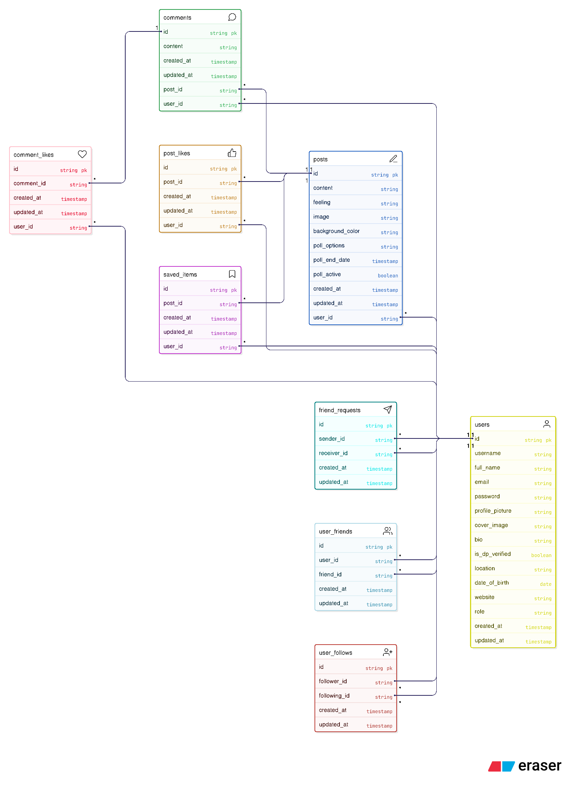
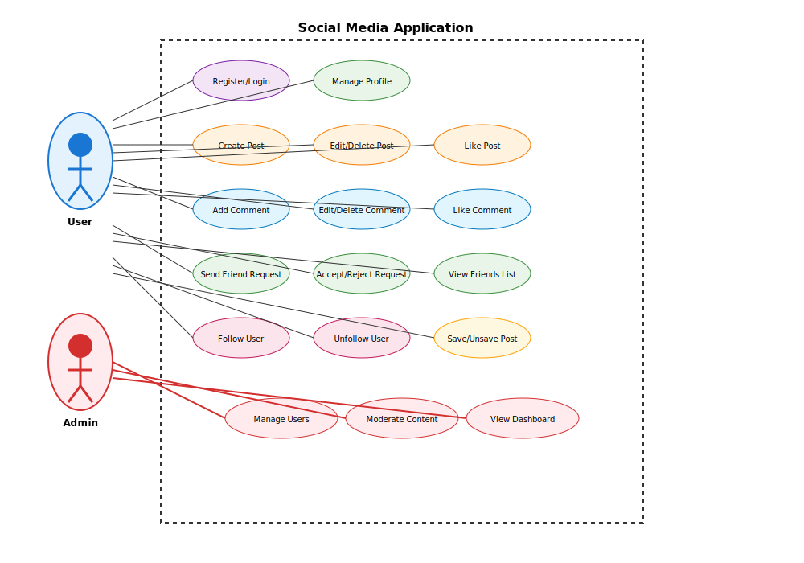
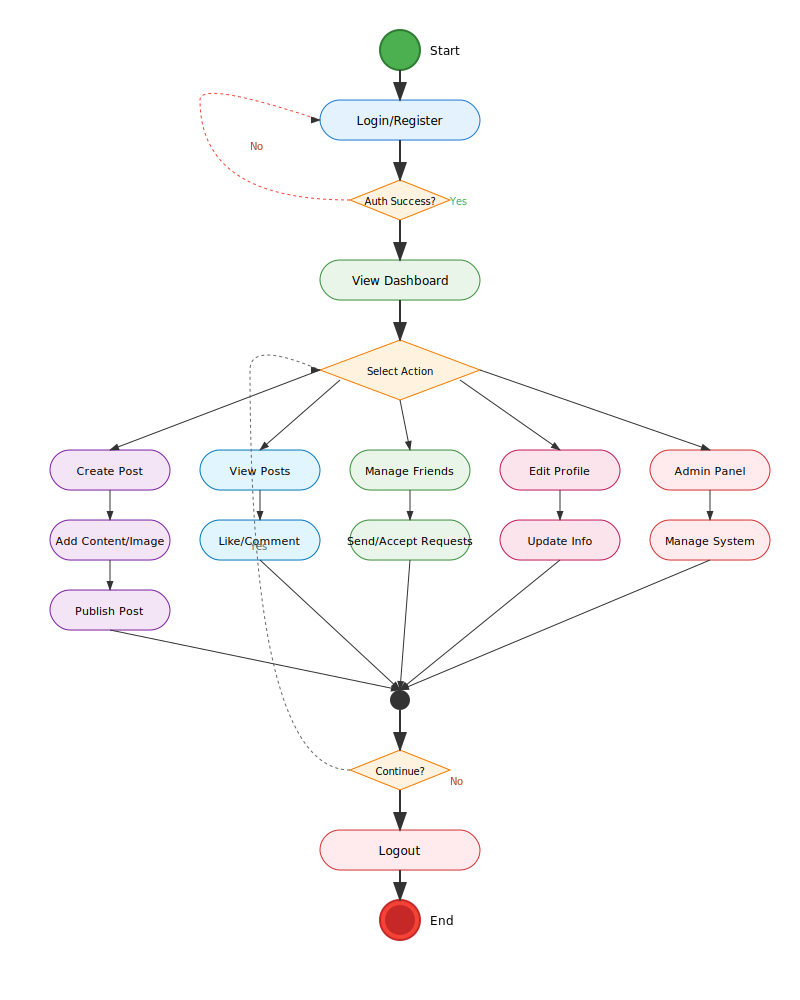

# Social Media Application - System Documentation

## Table of Contents
1. [Application Overview](#application-overview)
2. [Entity Relationship (ER) Diagram](#entity-relationship-er-diagram)
3. [Use Case Diagram](#use-case-diagram)
4. [Activity Diagram](#activity-diagram)
5. [Database Schema SQL Queries](#database-schema-sql-queries)
6. [User Interface & Features](#user-interface--features)

## Application Overview

This social media application is built using the PERN stack (PostgreSQL, Express.js, React, Node.js) and provides a comprehensive platform for social networking with modern features and admin capabilities.

## Entity Relationship (ER) Diagram

## Use Case Diagram

## Activity Diagram

## System Features Summary

### Core Functionalities
1. **User Management**: Registration, login, profile management, role-based access
2. **Post Management**: Create, edit, delete posts with images and polls
3. **Social Interactions**: Like posts/comments, comment on posts
4. **Friend System**: Send/accept/reject friend requests, manage friendships
5. **Follow System**: Follow/unfollow users
6. **Content Saving**: Save/unsave posts for later viewing
7. **Admin Panel**: User management, content moderation, system statistics

### Security Features
- JWT-based authentication
- Password hashing with bcrypt
- Role-based authorization
- Input validation and sanitization
- Protected routes and middleware

### Database Design Principles
- Normalized database structure
- Foreign key constraints for data integrity
- Unique constraints to prevent duplicates
- Indexes for optimal query performance
- UUID primary keys for security
- Timestamps for audit trails

## User Interface & Features

### Frontend Components
- **Dashboard Feed**: Real-time post feed with interactive elements
- **User Profile Management**: Comprehensive profile editing and statistics
- **Admin Panel**: Complete administrative control with user management and analytics
- **Responsive Design**: Mobile-first approach with modern UI/UX

### Key Features
- **Secure Authentication**: JWT-based with role management
- **Rich Content Creation**: Posts with images, polls, and custom backgrounds
- **Social Interactions**: Likes, comments, shares, and real-time engagement
- **Friend Network**: Friend requests and following system
- **Content Management**: Save posts and organize personal collections
- **Admin Controls**: User moderation and system analytics

This documentation provides a comprehensive overview of the Social Media Application's architecture, database design, and system workflows.

